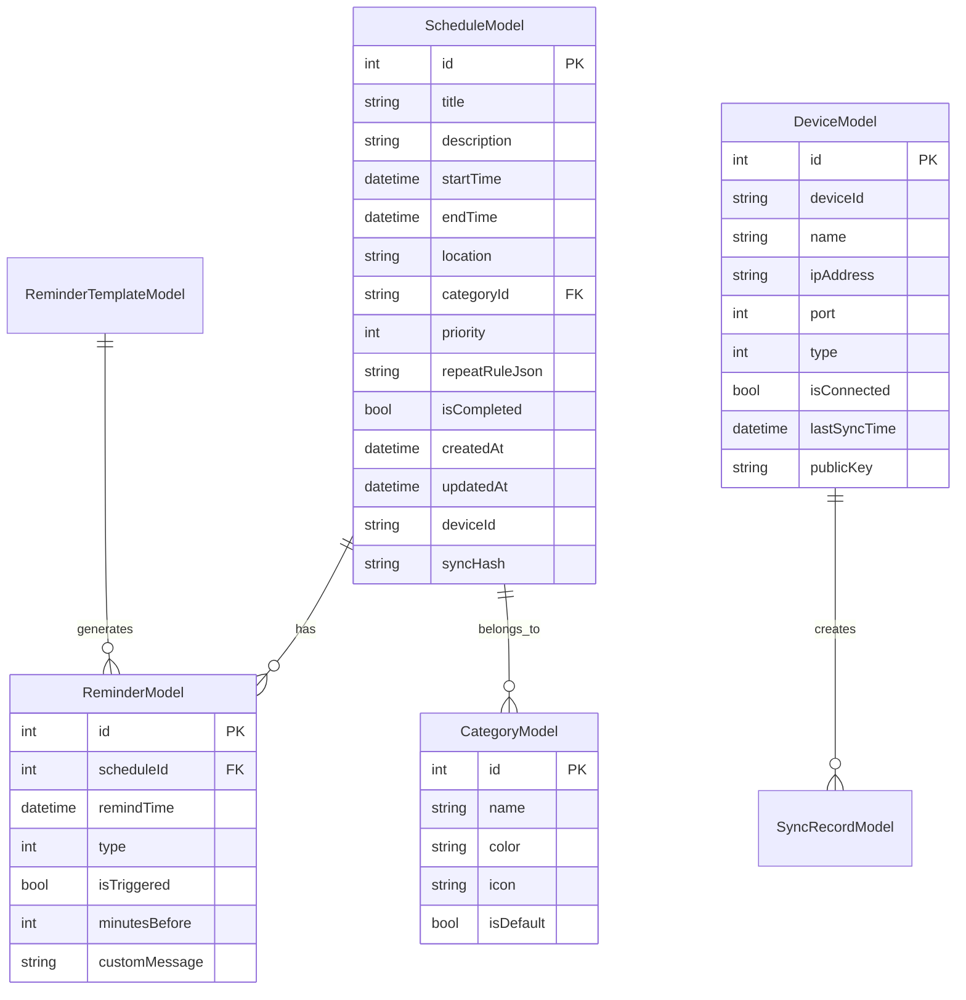

# Design Document

## Overview

The Clove Todo scheduling application is built using Flutter with Clean Architecture principles, providing a cross-platform solution for schedule management with local network synchronization capabilities. The system is designed to be scalable, maintainable, and testable, with clear separation of concerns across Domain, Data, and Presentation layers.

The application targets iOS, Android, Desktop (macOS, Windows, Linux), and HarmonyOS platforms, utilizing ObjectBox for high-performance local data storage and custom networking protocols for local area network synchronization.

## Architecture

### Clean Architecture Implementation

The application follows the Clean Architecture pattern with strict dependency inversion:

```
┌─────────────────────────────────────────────────────────────┐
│                    Presentation Layer                        │
│  ┌─────────────┐  ┌─────────────┐  ┌─────────────────────┐  │
│  │    BLoC     │  │   Pages     │  │      Widgets        │  │
│  │   Events    │  │  Screens    │  │   Components        │  │
│  │   States    │  │             │  │                     │  │
│  └─────────────┘  └─────────────┘  └─────────────────────┘  │
└─────────────────────────────────────────────────────────────┘
                              │
                              ▼
┌─────────────────────────────────────────────────────────────┐
│                      Domain Layer                           │
│  ┌─────────────┐  ┌─────────────┐  ┌─────────────────────┐  │
│  │  Entities   │  │ Use Cases   │  │    Repository       │  │
│  │   Models    │  │  Business   │  │    Interfaces       │  │
│  │             │  │   Logic     │  │                     │  │
│  └─────────────┘  └─────────────┘  └─────────────────────┘  │
└─────────────────────────────────────────────────────────────┘
                              │
                              ▼
┌─────────────────────────────────────────────────────────────┐
│                       Data Layer                            │
│  ┌─────────────┐  ┌─────────────┐  ┌─────────────────────┐  │
│  │   Models    │  │ Data Sources│  │    Repository       │  │
│  │    DTOs     │  │Local/Remote │  │  Implementation     │  │
│  │             │  │             │  │                     │  │
│  └─────────────┘  └─────────────┘  └─────────────────────┘  │
└─────────────────────────────────────────────────────────────┘
```

### Technology Stack

- **Framework**: Flutter 3.x with Dart
- **State Management**: flutter_bloc (BLoC pattern)
- **Dependency Injection**: get_it + injectable
- **Local Database**: ObjectBox (high-performance NoSQL)
- **Networking**: dio (HTTP client) + custom UDP/TCP for device discovery
- **Serialization**: json_serializable + json_annotation
- **Routing**: go_router + go_router_builder (type-safe routing)
- **Notifications**: flutter_local_notifications
- **UI Framework**: Material Design 3

## Components and Interfaces

### Core Components

#### 1. Schedule Management System
- **ScheduleRepository**: Interface for schedule CRUD operations
- **ScheduleLocalDataSource**: ObjectBox-based local storage
- **ScheduleRemoteDataSource**: Network synchronization handler
- **ScheduleBloc**: State management for schedule operations

#### 2. Reminder System
- **ReminderRepository**: Interface for reminder management
- **NotificationService**: Cross-platform notification delivery
- **ReminderScheduler**: Background task scheduling
- **ReminderTemplateManager**: Template configuration management

#### 3. Synchronization Engine
- **SyncRepository**: Interface for device synchronization
- **DeviceDiscoveryService**: Local network device detection
- **ConflictResolver**: Data conflict resolution logic
- **SyncStateManager**: Synchronization status tracking

#### 4. Data Persistence Layer
- **ObjectBoxService**: Database initialization and management
- **BackupService**: Data export/import functionality
- **MigrationService**: Database schema versioning

### Interface Definitions

```dart
// Domain Layer Interfaces
abstract class ScheduleRepository {
  Future<Either<Failure, List<Schedule>>> getSchedules();
  Future<Either<Failure, Schedule>> getScheduleById(String id);
  Future<Either<Failure, Schedule>> addSchedule(Schedule schedule);
  Future<Either<Failure, Schedule>> updateSchedule(Schedule schedule);
  Future<Either<Failure, void>> deleteSchedule(String id);
  Future<Either<Failure, List<Schedule>>> getSchedulesByDateRange(DateTime start, DateTime end);
  Future<Either<Failure, List<Schedule>>> searchSchedules(String query);
}

abstract class ReminderRepository {
  Future<Either<Failure, List<Reminder>>> getRemindersForSchedule(String scheduleId);
  Future<Either<Failure, Reminder>> addReminder(Reminder reminder);
  Future<Either<Failure, void>> cancelReminder(String reminderId);
  Future<Either<Failure, List<ReminderTemplate>>> getReminderTemplates();
}

abstract class SyncRepository {
  Future<Either<Failure, List<Device>>> discoverDevices();
  Future<Either<Failure, void>> syncWithDevice(Device device);
  Future<Either<Failure, SyncStatus>>> getSyncStatus();
  Future<Either<Failure, void>> resolveConflict(ConflictResolution resolution);
}
```

## Data Models

### Domain Entities

#### Schedule Entity
```dart
class Schedule {
  final String id;
  final String title;
  final String? description;
  final DateTime startTime;
  final DateTime endTime;
  final String? location;
  final String categoryId;
  final Priority priority;
  final RepeatRule? repeatRule;
  final List<Reminder> reminders;
  final bool isCompleted;
  final DateTime createdAt;
  final DateTime updatedAt;
  final String? deviceId;
  final String? syncHash;
}

enum Priority { low, medium, high }

class RepeatRule {
  final RepeatType type;
  final int interval;
  final List<int>? daysOfWeek;
  final DateTime? endDate;
  final int? occurrences;
}

enum RepeatType { none, daily, weekly, monthly, yearly, custom }
```

#### Reminder Entity
```dart
class Reminder {
  final String id;
  final String scheduleId;
  final DateTime remindTime;
  final ReminderType type;
  final bool isTriggered;
  final int minutesBefore;
  final String? customMessage;
}

enum ReminderType { notification, sound, vibration, email }
```

#### Device Entity
```dart
class Device {
  final String id;
  final String name;
  final String ipAddress;
  final int port;
  final DeviceType type;
  final bool isConnected;
  final DateTime? lastSyncTime;
  final String? publicKey;
}

enum DeviceType { mobile, desktop, tablet }
```

### Data Models (ObjectBox)

#### ScheduleModel
```dart
@Entity()
class ScheduleModel {
  @Id()
  int id = 0;
  
  String title;
  String? description;
  DateTime startTime;
  DateTime endTime;
  String? location;
  String categoryId;
  int priority;
  String? repeatRuleJson;
  bool isCompleted;
  DateTime createdAt;
  DateTime updatedAt;
  String? deviceId;
  String? syncHash;
  
  @Backlink()
  final reminders = ToMany<ReminderModel>();
  
  // Conversion methods
  Schedule toEntity() { /* implementation */ }
  factory ScheduleModel.fromEntity(Schedule schedule) { /* implementation */ }
  
  // JSON serialization for sync
  Map<String, dynamic> toJson() { /* implementation */ }
  factory ScheduleModel.fromJson(Map<String, dynamic> json) { /* implementation */ }
}
```

### Database Schema Design



## Correctness Properties

*A property is a characteristic or behavior that should hold true across all valid executions of a system-essentially, a formal statement about what the system should do. Properties serve as the bridge between human-readable specifications and machine-verifiable correctness guarantees.*

### Property Analysis

Based on the acceptance criteria analysis, the following properties ensure system correctness:

**Property 1: Schedule Creation Completeness**
*For any* valid schedule input containing required fields (title, start time, end time), creating a schedule should result in a stored schedule item with all provided data and system-generated metadata (id, creation timestamp, modification timestamp)
**Validates: Requirements 1.1, 1.2**

**Property 2: Reminder Time Calculation Accuracy**
*For any* schedule item and reminder configuration, the calculated reminder time should equal the schedule start time minus the specified minutes-before value
**Validates: Requirements 2.1, 2.3**

**Property 3: Default Reminder Application**
*For any* schedule item created without explicit reminder settings, the system should automatically create a reminder set for 30 minutes before the start time
**Validates: Requirements 2.1**

**Property 4: Template Reminder Configuration Consistency**
*For any* reminder template applied to a schedule item, all reminder settings should match the template configuration exactly
**Validates: Requirements 2.2, 5.3**

**Property 5: Search Result Relevance**
*For any* search query and schedule database, all returned results should contain the search terms in at least one of the searchable fields (title, description, location)
**Validates: Requirements 3.5**

**Property 6: Filter Application Correctness**
*For any* applied filter criteria (category, priority, date range), all displayed schedule items should match the filter conditions
**Validates: Requirements 3.3, 3.4**

**Property 7: Synchronization Data Integrity**
*For any* schedule item synchronized between devices, the data on all connected devices should be identical after synchronization completes
**Validates: Requirements 4.2, 4.5**

**Property 8: Conflict Resolution Consistency**
*For any* conflicting schedule modifications on multiple devices, applying timestamp-based conflict resolution should result in the most recently modified version being preserved across all devices
**Validates: Requirements 4.3**

**Property 9: Backup Data Completeness**
*For any* backup operation, the exported data should contain all schedule items, reminders, categories, and metadata that exist in the local database
**Validates: Requirements 6.1**

**Property 10: Restore Data Integrity Round-trip**
*For any* valid backup file, importing the data and then immediately exporting it should produce identical data structures
**Validates: Requirements 6.3**

**Property 11: Notification Delivery Timing**
*For any* scheduled reminder, the notification should be delivered within 30 seconds of the calculated reminder time
**Validates: Requirements 2.4**

**Property 12: Data Persistence Durability**
*For any* schedule item saved to the database, the item should remain accessible after application restart
**Validates: Requirements 8.4**

## Error Handling

### Error Classification

#### Domain Failures
```dart
abstract class Failure {
  final String message;
  const Failure(this.message);
}

class ValidationFailure extends Failure {
  const ValidationFailure(String message) : super(message);
}

class NotFoundFailure extends Failure {
  const NotFoundFailure(String message) : super(message);
}

class ConflictFailure extends Failure {
  const ConflictFailure(String message) : super(message);
}
```

#### Data Layer Exceptions
```dart
class DatabaseException implements Exception {
  final String message;
  const DatabaseException(this.message);
}

class NetworkException implements Exception {
  final String message;
  final int? statusCode;
  const NetworkException(this.message, [this.statusCode]);
}

class SyncException implements Exception {
  final String message;
  final SyncErrorType type;
  const SyncException(this.message, this.type);
}

enum SyncErrorType { deviceNotFound, connectionTimeout, dataCorruption, conflictResolution }
```

### Error Recovery Strategies

1. **Network Failures**: Implement exponential backoff retry mechanism with offline queue
2. **Database Corruption**: Automatic backup restoration with user notification
3. **Sync Conflicts**: Timestamp-based resolution with manual override options
4. **Validation Errors**: Immediate user feedback with correction suggestions
5. **Resource Constraints**: Graceful degradation with performance optimization

## Testing Strategy

### Dual Testing Approach

The application employs both unit testing and property-based testing to ensure comprehensive coverage:

#### Unit Testing Strategy
- **Domain Layer**: Test individual use cases with mocked repositories
- **Data Layer**: Test repository implementations with mocked data sources
- **Presentation Layer**: Test BLoC state transitions and widget behavior
- **Integration**: Test complete user workflows end-to-end

#### Property-Based Testing Strategy

**Framework**: We will use the `test` package with custom property testing utilities, implementing a lightweight property-based testing framework suitable for Flutter applications.

**Configuration**: Each property-based test will run a minimum of 100 iterations to ensure statistical confidence in the results.

**Test Implementation Requirements**:
- Each correctness property must be implemented by a single property-based test
- Tests must be tagged with the format: `**Feature: clove-todo-scheduling, Property {number}: {property_text}**`
- Tests should generate diverse, realistic input data that covers edge cases
- Generators should be constrained to valid input domains to avoid trivial failures

#### Test Coverage Targets
- **Domain Layer**: 100% (critical business logic)
- **Data Layer**: ≥ 80% (focus on mapping and error handling)
- **Presentation Layer (State Management)**: ≥ 90% (critical for UX)
- **Presentation Layer (UI Widgets)**: ≥ 70% (focus on user interactions)
- **Core & Shared Utilities**: ≥ 90% (foundational components)

#### Property Test Examples

```dart
// Example property test structure
group('Schedule Management Properties', () {
  testProperty(
    '**Feature: clove-todo-scheduling, Property 1: Schedule Creation Completeness**',
    forAll(scheduleInputGenerator, (input) {
      // Test that creating a schedule with valid input results in complete stored data
      final result = scheduleRepository.addSchedule(input);
      return result.fold(
        (failure) => false,
        (schedule) => schedule.hasAllRequiredFields() && 
                     schedule.hasValidTimestamps() &&
                     schedule.containsAllInputData(input),
      );
    }),
    iterations: 100,
  );
});
```

### Testing Infrastructure

#### Mock Generation
```dart
// Using mockito for dependency mocking
@GenerateMocks([
  ScheduleRepository,
  ReminderRepository,
  SyncRepository,
  NotificationService,
  ObjectBoxService,
])
void main() {}
```

#### Test Data Generators
```dart
// Property test generators
Generator<Schedule> get scheduleGenerator => Generator.combine3(
  stringGenerator(minLength: 1, maxLength: 100), // title
  dateTimeGenerator(min: DateTime.now()), // startTime  
  dateTimeGenerator(min: DateTime.now().add(Duration(hours: 1))), // endTime
  (title, start, end) => Schedule(
    id: uuid.v4(),
    title: title,
    startTime: start,
    endTime: end,
    // ... other fields
  ),
);
```

This comprehensive testing strategy ensures that both specific examples work correctly (unit tests) and that general properties hold across all possible inputs (property-based tests), providing confidence in the system's correctness and reliability.